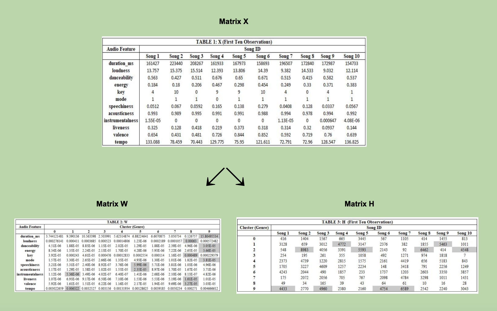

# CMSC-35300: Mathematical-Foundations-of-Machine-Learning

This repository contains the final project (code + writeup) for the course CMSC35300: Mathematical Foundations of Machine Learning at the University of Chicago. This course was jointly taught by Professor Rebecca Willett and Professor Eric Jonas in Fall 2022.

## Project Summary:
Analyse audio features of songs from Spotify and use a non-negative matrix factorization to cluster songs into various genres

## Matrices and Clusters 

### Data Source:
* Kaggle (Spotify dataset)

Note: The artists.csv and tracks.csv were too large to upload to GitHub. 

